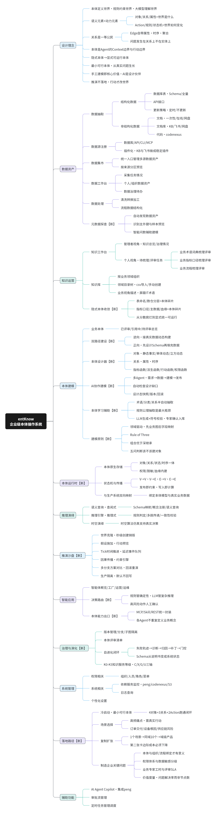

# entKnow · OntoOS

> 企业级本体操作系统 —— 本体定义世界，规则约束世界，大模型理解世界。
>
> An enterprise-grade Ontology OS for AI applications: turn implicit enterprise knowledge into an explicit, runnable, governed ontology.

[](LICENSE)


## 这是什么

entKnow（OntoOS）是一个对标 [Palantir Foundry Ontology](https://www.palantir.com/docs/foundry/ontology/overview/) 的开源实现探索：把散落在库表结构、指标口径、SOP 文档中的企业"隐式本体"，收敛为**显式、可运行、可治理**的本体，并在其上提供语义查询、推理、沙盘推演与行动能力，作为 AI Agent 的 **Context 边界与行动边界**。

当前仓库为**前端高保真原型**（React + Ant Design + 共享 Mock 数据），用于产品形态验证与评审；后端服务规划见 [路线图](#路线图)。

## 核心理念

- **语义元素 + 动力元素**：对象 / 关系 / 属性描述"世界是什么"；Action / 规则 / 状态机描述"世界如何变化"
- **关系是一等公民**：Edge 自带属性、时序与聚合——业务问题发生在关系上，不在实体上
- **推演不落地，行动才改世界**：沙盘推演生产隔离，经过治理的行动才回写
- **最小可行本体**：从真实问题生长（4 对象 + 3 关系 + 2 Action 跑通闭环），而不是一次性 grand design
- **手工建模是核心价值，AI 是设计伙伴**：LLM 生成 + 符号校验 + 专家确认入库

## 功能模块

| 模块 | 名称 | 内容 |
|---|---|---|
| M1 | 数据资产 | 数据源中心（结构化 / 文档库）、元数据探查、数据集市、数据加工流水线、联邦逻辑视图 |
| M2 | 知识运营 | 知识库（按业务领域的领域树）、知识治理（隐式本体收敛 / 同义词 / 交叉引用） |
| M3 | 本体建模 | 本体管理（注册中心与生命周期）、本体设计器（对象 / 关系 / 函数）、智能建模（七步法向导 / AI 会话 / 语料提取） |
| M4 | 本体运行时 | 数据绑定与实例化、实例 360°、状态机传播与行动网关 |
| M5 | 推理演绎 | 语义查询、规则推理、OWL 推理器 |
| M6 | 推演沙盘 | 世界克隆、假设施加、Tick 时间推进、多分支对比、生产隔离 |
| M7 | 智能应用 | MCP / REST / CLI 统一能力出口 |
| M8 | 治理演化 | 评审与发布门禁（K 等级）、版本 / 分支 / 撤回对账 |
| M9 | 系统管理 | 组织与权限、监控与日志、个性化设置 |

示例场景为**供应链「订单交付风险」**：多源数据（MySQL / PostgreSQL / SQLServer / Oracle / ClickHouse / 飞书知识库）→ 本体（供应商、工厂、物料、采购订单…）→ 指标与行动（供应商准时率、交付风险处置）。

## 架构



（Mermaid 源文件：[architecture-mindmap.mmd](docs/architecture/architecture-mindmap.mmd)）

整体分为两个平面：

- **平台平面**（entKnow）：本体治理、评审发布、数据绑定、运行时、能力出口；
- **引擎平面**（复用外部服务）：语料提取与双时态事实账本复用 [Utopia](docs/utopia-integration.md)（Rust，服务级对接，不依赖其内部 crate），联邦查询等按需引入现成引擎。

与 Utopia 的集成方案（四条链路：文档推送 / 观测推送 / 提案回流 / MCP 工具源）见 **[docs/utopia-integration.md](docs/utopia-integration.md)**。

## 技术栈

- [React 19](https://react.dev) + [TypeScript](https://www.typescriptlang.org/) + [Vite 8](https://vite.dev)
- [Ant Design 6](https://ant.design) + [@ant-design/icons](https://ant.design/components/icon)
- [React Router 7](https://reactrouter.com)
- [Oxlint](https://oxc.rs) 代码检查

## 快速开始

要求 Node.js ≥ 20.19（推荐 22 LTS）。

```bash
npm install     # 安装依赖
npm run dev     # 启动开发服务器 → http://localhost:5188
npm run build   # 类型检查 + 生产构建
npm run preview # 预览构建产物
npm run lint    # Oxlint 检查
```

### 演示要点

原型内置三种演示角色（顶栏头像处切换），首页形态随之变化：

| 角色 | 人物 | 视角 |
|---|---|---|
| 构建者 | 张三 · 数据架构师 | 分阶段引导（环境准备 → 数据准备 → 本体建模 → 验证交付）+ AI Skill 入口 |
| 管理层 | 李四 · 供应链总监 | 管辖范围运营看板 + 待办审批 |
| 业务专家 | 王五 · 业务专家 | 业务语言的知识与问答入口 |

其他可体验点：

- 顶栏**切换当前本体**（供应链 / 质量追溯 / 设备运维），角色（所有者 / 建模者 / 评审者 / 查看者）随本体变化并影响页面可操作性；
- 所有页面数据来自共享 Mock（`src/mock/data.ts`），跨屏实体、数字、状态一致；
- 占位按钮通过 `src/components/proto.tsx` 提供最小真实反馈（toast / 表单 / 确认 / 详情）。

## 目录结构

```
├── docs/
│   ├── architecture/          # 产品架构思维导图（Mermaid 源文件 + 渲染图）
│   └── utopia-integration.md  # Utopia 集成架构设计（已评审基线）
├── public/
├── src/
│   ├── components/            # TabHub（Tab 收纳容器）、proto（原型交互助手）
│   ├── layouts/AppShell.tsx   # 全局框架：导航、本体切换、角色、消息通知
│   ├── mock/data.ts           # 全局共享 Mock（供应链订单交付风险场景）
│   ├── pages/                 # Home + m1–m9 各模块页面
│   ├── theme.ts               # antd 设计令牌（祖母绿 + 暖灰）
│   ├── App.tsx                # 路由定义（含旧路径重定向）
│   └── main.tsx
├── index.html
└── package.json
```

## 路线图

- [ ] 后端平台平面：Go 实现 API 服务、连接器 / 同步框架、管道编排（Temporal）、权限与审计、能力出口
- [ ] `utopia-adapter`：按集成文档对接 Utopia（文档推送 → 提案回流 → MCP 工具源 → 观测推送）
- [ ] 运行时引擎：状态传播引擎、沙盘 Tick 引擎（按性能需求单点引入）
- [ ] 本体原生存储与联邦查询落地

## 参与贡献

欢迎通过 Issue 与 PR 参与讨论和建设。提交前请运行 `npm run lint`。

## 许可证

[Apache-2.0](LICENSE)
